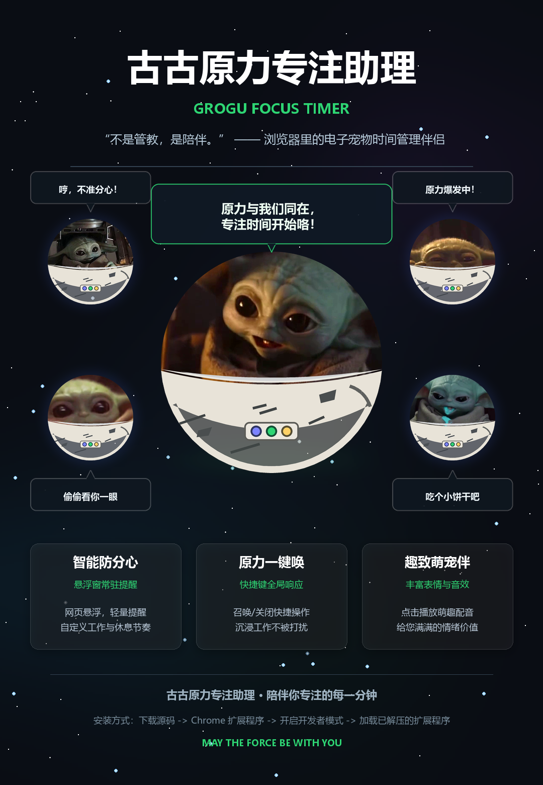

# 尤达宝宝时间管理 (Grogu Focus Timer)

<p align="center">
  <strong>简体中文</strong> | <a href="./README_en.md">English</a>
</p>

<p align="center">
  
</p>

<p align="center">
  <strong>古古划过你的夜空，随机表情包像流星一样出现。</strong>
</p>

<p align="center">
  电子萌宠 + 时间管理。陪你专注，也提醒你别再找不干活的借口。
</p>

一个浏览器里的陪伴电子宠物插件。

它不是严肃的效率管理软件，也不试图用报表和惩罚控制你。它更像一个会漂过网页的小伙伴：你在写作、编码、阅读时，它安静陪着；你偏离当前任务时，它用一个短短的 `NO` 轻轻提醒你。

> 不是管教，是陪伴。


<p align="center">
  
</p>


## 亮点

- **漂浮摇篮陪伴**：古古会坐在小摇篮里，以轻微漂浮的方式出现在网页上。
- **YES / NO 轻提醒**：回到工作页面时给你一点鼓励，进入分心页面时给你一个温柔的提醒。
- **随机表情事件**：吃点心、偷偷看你、发功、招手等小动画会随机出现，增加一点情绪价值。
- **声音反馈**：不同表情配有短音效，也可以在设置中关闭。
- **可自定义分心规则**：支持默认网站分类，也可以添加自己的关键词或正则。
- **网页内快捷键召唤**：给常用表情设置快捷键，随时把古古叫出来。
- **Chrome Side Panel**：点击插件图标可打开侧边栏控制面板。

## 适合什么场景

- 写代码时想要一个轻陪伴。
- 在线写作、整理资料时需要一点仪式感。
- 看新闻、刷视频、逛网站时，希望有人轻轻提醒你“是不是偏航了”。
- 不想用强约束工具，但想让浏览器变得更有趣。

## 安装方式

目前是本地开发版 Chrome 插件。

1. 打开 Chrome，进入 `chrome://extensions/`
2. 打开右上角“开发者模式”
3. 点击“加载已解压的扩展程序”
4. 选择本项目里的 `extension` 文件夹
5. 点击浏览器工具栏中的插件图标，打开侧边栏

## 使用方式

1. 设置当前任务，例如“写代码”“写作”“阅读资料”
2. 设置专注时间和休息时间
3. 选择默认分心分类，或添加自己的分心关键词
4. 点击“开启原力”
5. 让古古在网页上陪你一会儿

## 项目结构

```text
grogu-focus-timer/
  extension/          Chrome 插件源码
    manifest.json     Manifest V3 配置
    background.js     计时器、分心检测、随机事件调度
    content.js        网页内古古浮层注入
    content.css       摇篮、漂浮、表情动效
    popup.html        侧边栏控制面板
    popup.js          设置、按钮、快捷键逻辑
    offscreen.*       Manifest V3 音频播放
    assets/           表情 WebP、音频和图标
  tests/              最小回归测试
  source_materials/   原始素材和宣传材料
```

## 技术实现

- Chrome Extension Manifest V3
- `chrome.alarms` 管理专注计时和随机事件
- `chrome.scripting` 注入网页浮层
- `chrome.offscreen` 播放音频
- Content Script 捕获网页内快捷键
- SVG + CSS 动画绘制小摇篮、LED 和漂浮路径

## 当前状态

这是一个个人实验项目，重点先放在“陪伴感”和“出现那一秒的可爱程度”上。

时间管理功能保留为轻提醒，不追求复杂报表或强制拦截。

## 注意

本项目仅用于个人学习和原型实验。角色风格和素材灵感来自流行文化中的可爱外星宝宝形象；如果用于公开发布或商店上架，建议替换为原创角色、原创名称和原创素材。
